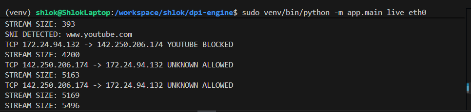
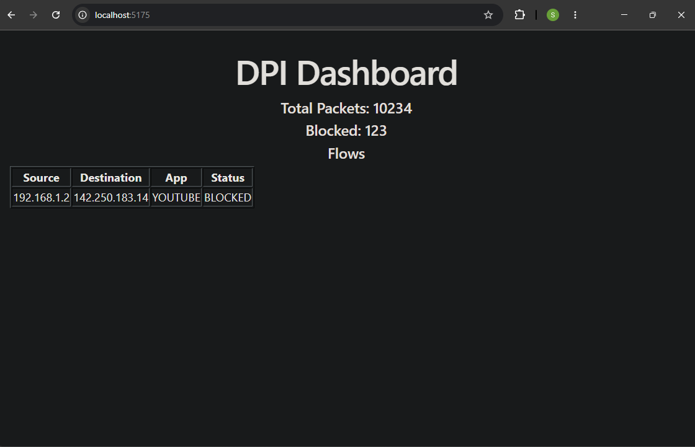
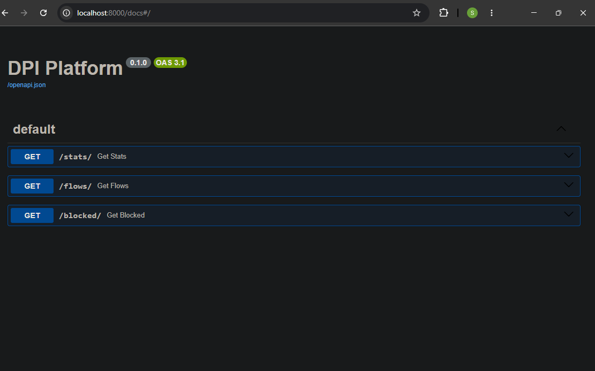

# DPI Engine — Deep Packet Inspection Platform

A modular Deep Packet Inspection (DPI) platform built in Python supporting:

- Live packet inspection
- Offline PCAP analysis
- TLS SNI extraction
- TCP stream reconstruction
- Application classification
- Rule-based traffic blocking
- FastAPI analytics backend
- React monitoring dashboard
- PostgreSQL integration
- ML-ready anomaly detection pipeline

---

# Features

## DPI Core
- Live network traffic inspection
- Offline PCAP processing
- TLS ClientHello parsing
- SNI extraction
- TCP stream reconstruction
- Flow tracking
- Rule-based blocking engine

## Backend
- FastAPI REST APIs
- Swagger/OpenAPI documentation
- PostgreSQL analytics layer

## Frontend
- React dashboard
- Flow visualization
- Blocked traffic monitoring
- Traffic analytics

## ML
- IsolationForest anomaly detection scaffold
- Feature engineering pipeline

---

# Architecture

```text
                Live Capture / PCAP
                         │
                         ▼
                 DPI Engine Core
                         │
         ┌───────────────┼───────────────┐
         ▼                               ▼
 PostgreSQL                        FastAPI Backend
         │                               │
         └───────────────┬───────────────┘
                         ▼
                   React Dashboard
```

---

# Project Structure

```text
dpi-engine/
│
├── app/                 # Core DPI Engine
├── backend/             # FastAPI Backend
├── frontend/            # React Dashboard
├── pcaps/
├── outputs/
├── screenshots/
└── README.md
```

---

# Screenshots

## Live Traffic Detection



---

## React Dashboard



---

## FastAPI Swagger Docs



---

# Tech Stack

## Backend
- Python
- FastAPI
- SQLAlchemy
- PostgreSQL

## Networking
- Scapy
- TLS Inspection
- TCP Stream Reconstruction

## Frontend
- React
- Axios
- Vite

## ML
- Scikit-learn
- IsolationForest

---

# Setup

## Clone Repository

```bash
git clone https://github.com/shlok-git340/dpi-engine.git
cd dpi-engine
```

---

## Create Virtual Environment

```bash
python3 -m venv venv
source venv/bin/activate
```

---

## Install Dependencies

```bash
pip install \
scapy \
rich \
typer \
pyshark \
fastapi \
uvicorn \
sqlalchemy \
psycopg2-binary \
pydantic \
scikit-learn \
numpy \
pandas
```

---

# Run DPI Engine

## Live Capture

```bash
sudo venv/bin/python -m app.main live eth0
```

## Offline PCAP Analysis

```bash
python -m app.main offline input.pcap output.pcap
```

---

# Run Backend

```bash
cd backend
uvicorn app.api.main:app --reload
```

---

# Run Frontend

```bash
cd frontend
npm install
npm run dev
```

---

# API Documentation

After starting FastAPI backend:

```text
http://localhost:8000/docs
```

---

# Future Improvements

- QUIC/HTTP3 inspection
- Real-time WebSocket streaming
- Distributed packet processing
- Advanced anomaly detection
- Threat intelligence integration
- Multi-threaded packet pipeline

---

# Learning Outcomes

This project helped me explore:
- Network protocol analysis
- Deep packet inspection
- TLS parsing
- TCP stream reconstruction
- Full-stack systems architecture
- Backend API design
- Traffic analytics pipelines
- ML-ready security architectures

---
